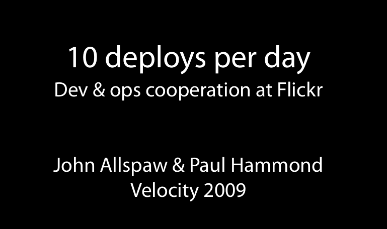
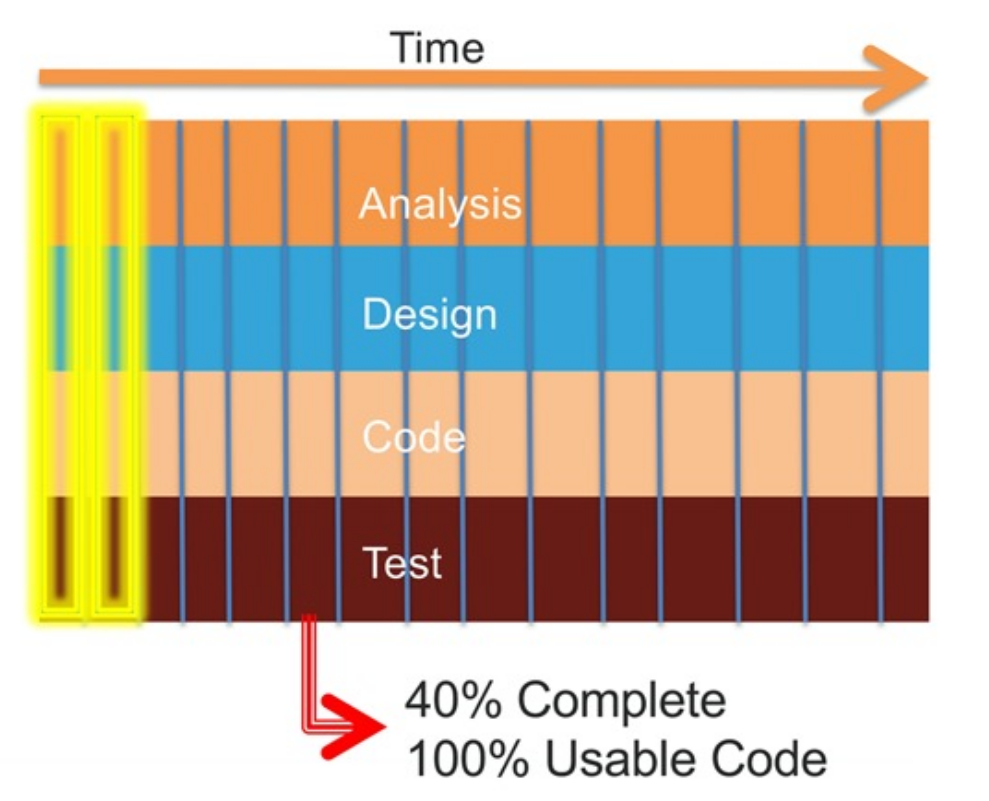
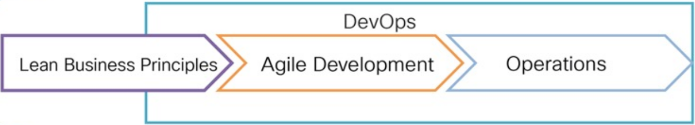
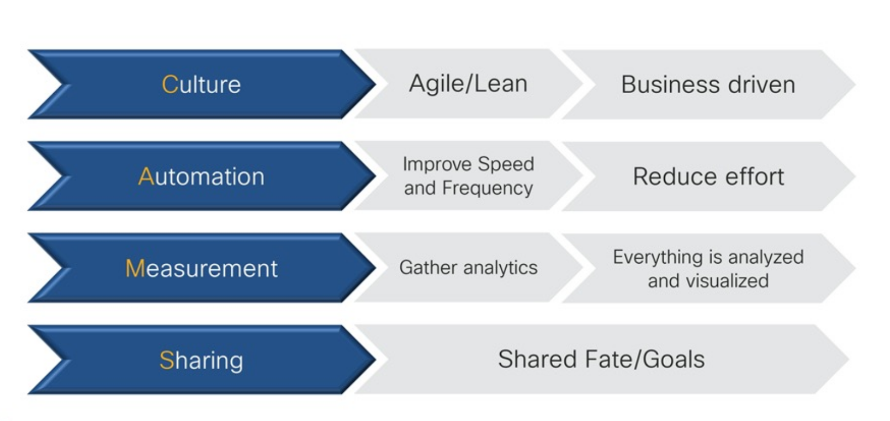
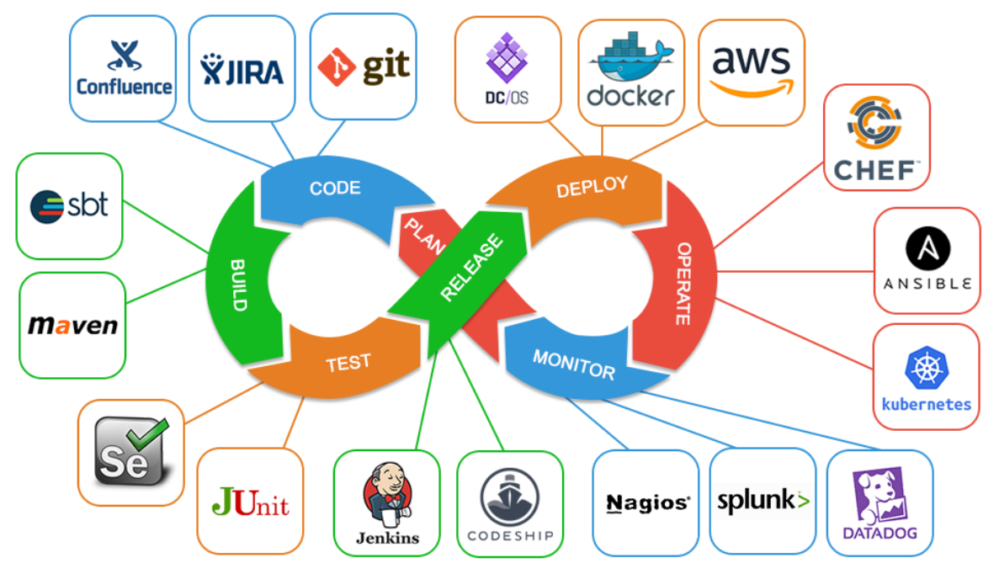
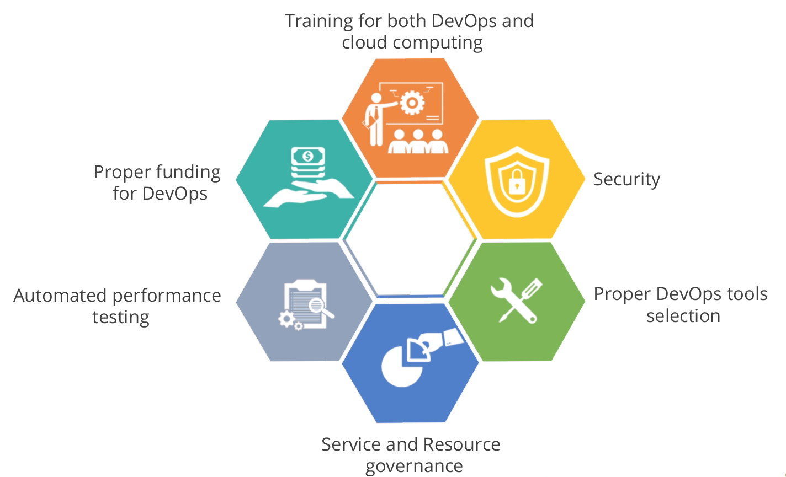
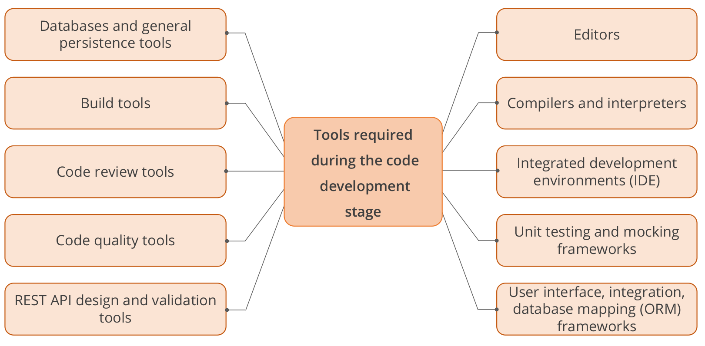
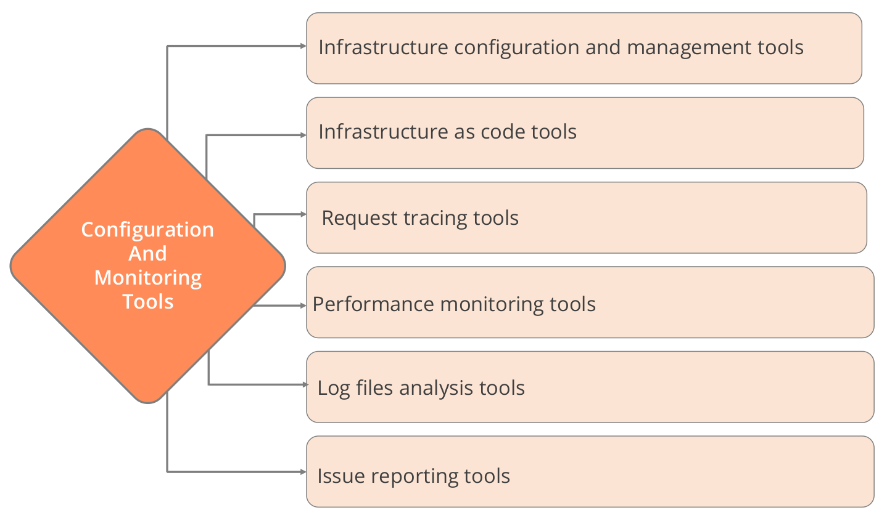

# Introduction to DevOps - Part I

Author: **Kaan Keskin**

Date: April 2021

Available at: https://github.com/kaan-keskin/introduction-to-devops

### Introduction

**DevOps** is short for **Dev**elopment and **Op**eration**s**.
It concentrates on collaboration between developers and other parties involved in building, deploying, operating, and maintaining software systems.

DevOps is a software engineering culture that unites the development and operations team under an umbrella of tools to automate every stage.

**DevOps is a set of cultural norms and technical practices that enable this fast flow of work from dev through test through operations while preserving world class reliability.** - Gene Kim

**DevOps blends lean thinking with agile philosophy.**


## A Brief History of DevOps

Basically, the timeline goes something like this:

- Patrick Debois, a Belgian consultant, project manager, and agile practitioner is one among the initiators of DevOps.

- **2007**: While consulting on a data center migration for the Belgium government, system administrator **Patrick Debois** becomes frustrated by conflicts between developers and system admins. He ponders solutions.

- **August 2008**: At the **Agile Conference in Toronto**, software developer **Andrew Shafer** posts notice of a “birds of a feather” session entitled “**Agile Infrastructure**”. 

    Exactly one person attends: You guessed it, Patrick Debois. And he has the room to himself; thinking there was no interest in his topic, Andrew skips his own session! Later, Debois tracks down Shafer for a wide-ranging hallway conversation. Based on their talk, they form the **Agile Systems Administration Group**.



- **June 2009**: At the **O’Reilly Velocity 09** conference, **John Allspaw** and **Paul Hammond** give their now-famous talk entitled “**10 Deploys a Day: Dev and Ops Cooperation at Flickr**”. Watching remotely, Debois laments on Twitter that he is unable to attend in person. Paul Nasrat tweets back, “Why not organize your own Velocity event in Belgium?”

    - [10+ Deploys per Day: Dev and Ops Cooperation at Flickr](https://learning.oreilly.com/videos/devops-in-practice/9781491902998/9781491902998-video169253) - 46 Minutes, June 23 2009

    - This presentation helped in bring out the ideas for DevOps and resolve the conflict of Dev versus Ops:
        - “It’s not my code, it’s your machines!”
        - "It’s not my machines, it’s your code!”
    
    - Traditional thinking:
        - Dev’s job is to add new features.
        - Ops’ job is to keep the site stable and fast.
    
    - **Ops’ job is NOT to keep the site stable and fast!**

    - **Ops’ job is to enable the business.**

    - **The business requires change, but change is the root cause of most outages!**

    - You have two options:
        - Discourage change in the interests of stability, or
        - **Allow change to happen as often as it needs to.**

    - **Lowering risk of change through tools and culture.**

    - **Ops** who think like devs, **Dev**s who think like ops!  

- **October 2009**: Debois decides to do exactly that—but first, he needs a name. He takes the first three letters of development and operations, adds the word “days,” and calls it **DevOpsDays**. The conference doors open on October 30 to an impressive collection of developers, system administrators, toolsmiths, and others. When the conference ends, the ongoing discussions move to Twitter. To create a memorable hashtag, Debois shortens the name to #DevOps. And the movement has been known as **DevOps** ever since.

- If you need to choose one author to learn DevOps culture and practices, you must read Gene Kim's books. My second suggestion is Jez Humble.

    - The Visible Ops Handbook, 2005
    - Continuous Delivery, 2010
    - The Phoenix Project, 2013
    - The DevOps Handbook, 2016
    - Accelerate, 2018
    - The Unicorn Project, 2019
    - Lean Enterprise, 2020


## Traditional Thinking

### Operations World

- Care About:
    - Everything is stable
    - Standards
    - Templates
    - Not getting bothered at 2:00 am

- Success:
    - Software is stable
    - Backup and restore works
    - Systems are operating within defined thresholds

### How Developers See Ops


### Developers World

- Care About:
    - Writing Software
    - Working Code
    - APIs
    - Libraries
    - Sprints

- Success:
    - Software Works - Laptop and Test
    - Finished Sprint

### How Ops See Developers


### Test Team World

- Care About:
    - Writing Test Code
    - Working Test Code
    - APIs
    - Frameworks
    - Sprints

- Success:
    - Test Works - Laptop and Testbed
    - Finished Sprint

### How Ops See Test Team


## Traditional Software Development Approach

### Traditional IT Service Delivery (Waterfall)

- Around since the 50s.

- Sequential Design Approach

- Requirements and scope are fixed.


### Challenges in the Traditional Approach

- Slow, manual, and error prone.

- The more complex a project becomes, the longer the schedule, and the higher the probability of scope and schedule surprises.

- **Waterfall Method:** Most of the development teams use waterfall method, which is time-consuming because of the larger size of the developer team, testers, and the code involved.

- **Productivity:** Codes that are large and bundled into release will result in jammed production and lower the productivity.

- **Difficult to Achieve Goal:** Less investment on resources and constant work make it difficult for the developers to achieve goal or an outcome.

- **Investment in Schedule Planning Systems:** More money is invested in schedule planning systems which are sensitive and inaccurate. As a result, it consumes more time to manage the systems.

### Before Agile Methodologies (Waterfall)


## A Brief History of Agile Methodologies and Frameworks

### Lean Management Philosophy

**Dr. William Edwards Deming (October 14, 1900 – December 20, 1993)** was an American engineer, statistician, professor, author, lecturer, and management consultant. Educated initially as an electrical engineer and later specializing in mathematical physics, he helped develop the sampling techniques still used by the U.S. Department of the Census and the Bureau of Labor Statistics.

Deming is best known for his work in Japan after WWII, particularly his work with the leaders of Japanese industry. That work began in July and August 1950, in Tokyo and at the Hakone Convention Center, when Deming delivered speeches on what he called "**Statistical Product Quality Administration**". 

Many in Japan credit Deming as one of the inspirations for what has become known as the **Japanese post-war economic miracle** of 1950 to 1960, when Japan rose from the ashes of war on the road to becoming the second-largest economy in the world through processes partially influenced by the ideas Deming taught:

- Better design of products to improve service
- Higher level of uniform product quality
- Improvement of product testing in the workplace and in research centers
- Greater sales through side [global] markets


Lean management principles include:

- Defining value from the standpoint of the end customer.
- Identifying each step in a business process and eliminating those steps that do not create value.
- Making the value-creating steps occur in a tight sequence.
- Repeating the first three steps on a continuous basis until all waste has been eliminated.

These lean principles ensure that production and market launch remain cost-effective.


Books written by W. Edwards Deming and fellows:

- Statistical Adjustment Of Data, 1943
- Some Theory of Sampling, 1950
- Sample Design in Business Research, 1960
- Quality Productivity and Competitive Position, 1982
- **Out of the Crisis, 1982**
- The New Economics for Industry, Government, Education, 2000
- **Lean Software Development: An Agile Toolkit, 2003**
- **The Lean Six Sigma Pocket Toolbook, 2004**
- **The Lean Startup, 2011**
- Statistical Method from the Viewpoint of Quality Control, 2012
- The Essential Deming: Leadership Principles from the Father of Quality, 2012


### Kanban
Kanban definition. Initially, it arose as **a scheduling system for lean manufacturing**, originating from the Toyota Production System (TPS).  

In the **late 1940s**, Toyota introduced “**just in time**” manufacturing to its production. The approach represents a pull system. This means that production is based on customer demand, rather than the standard push practice to produce goods and push them to the market.

Their unique production system laid the foundation of Lean manufacturing or simply Lean. Its core purpose is minimizing waste activities without sacrificing productivity. The main goal is to create more value for the customer without generating more costs.

#### The original Kanban System, Source: TOYOTA Global Website


#### The 4 Kanban Core Principles

- Principle 1: Start With What You Do Now
- Principle 2: Agree to Pursue Incremental, Evolutionary Change
- Principle 3: Respect the Current Process, Roles & Responsibilities
- Principle 4: Encourage Acts of Leadership at All Levels


### [Scrum](https://www.scrum.org/)

**Jeff Sutherland** and **Ken Schwaber** presented Scrum at **OOPSLA'95**. 

[OOPSLA (Object-Oriented Programming, Systems, Languages & Applications) is an annual ACM research conference.]

Scrum is a framework utilizing an agile mindset for developing, delivering, and sustaining complex products, with an initial emphasis on software development, although it has been used in other fields including research, sales, marketing and advanced technologies.

It is designed for teams of ten or fewer members, who break their work into goals that can be completed within time-boxed iterations, called sprints, no longer than one month and most commonly two weeks.

The Scrum Team assess progress in time-boxed daily meetings of 15 minutes or less, called daily scrums.

At the end of the sprint, the team holds two further meetings: the sprint review which demonstrates the work done to stakeholders to elicit feedback, and sprint retrospective which enables the team to reflect and improve. 

The main components of scrum framework are:

- The scrum roles: scrum master, scrum product owner and the development team
- The artefacts: sprint backlog, product backlog, burn down chart, log, etc
- Scrum events: sprint planning, sprint review, daily stand-up, sprint retro, etc
- Sprint


### [Extreme Programming (XP)](http://www.extremeprogramming.org/)

**Kent Beck** developed extreme programming during his work on the Chrysler Comprehensive Compensation System (C3) payroll project. Beck became the C3 project leader in March 1996. 

He began to refine the development methodology used in the project and wrote a book on the methodology (**Extreme Programming Explained, published in October 1999**). Chrysler cancelled the C3 project in February 2000, after seven years, when Daimler-Benz acquired the company.


Extreme Programming (XP) is an agile software development framework that aims to produce higher quality software, and higher quality of life for the development team. 

XP is the most specific of the agile frameworks regarding appropriate engineering practices for software development.

```
Extreme Programming (XP) was created in response to problem domains whose requirements change.

Your customers may not have a firm idea of what the system should do.

You may have a system whose functionality is expected to change every few months.

In many software environments dynamically changing requirements is the only constant.

This is when XP will succeed while other methodologies do not.
```

#### The Values of Extreme Programming 

**Simplicity:** **We will do what is needed and asked for, but no more.** This will maximize the value created for the investment made to date. We will take small simple steps to our goal and mitigate failures as they happen. We will create something we are proud of and maintain it long term for reasonable costs.

**Communication:** **Everyone is part of the team and we communicate face to face daily.** We will work together on everything from requirements to code. We will create the best solution to our problem that we can together.

**Feedback:** **We will take every iteration commitment seriously by delivering working software.** We demonstrate our software early and often then listen carefully and make any changes needed. We will talk about the project and adapt our process to it, not the other way around.

**Respect:** **Everyone gives and feels the respect they deserve as a valued team member.** Everyone contributes value even if it's simply enthusiasm. Developers respect the expertise of the customers and vice versa. Management respects our right to accept responsibility and receive authority over our own work.

**Courage:** **We will tell the truth about progress and estimates.** We don't document excuses for failure because we plan to succeed. We don't fear anything because no one ever works alone. We will adapt to changes when ever they happen.


#### XP Practices

The core of XP is the interconnected set of software development practices listed below. While it is possible to do these practices in isolation, many teams have found some practices reinforce the others and should be done in conjunction to fully eliminate the risks you often face in software development.

- The Planning Game
- Small Releases
- Metaphor
- Simple Design
- Testing
- Refactoring
- Pair Programming
- Collective Ownership
- Continuous Integration
- 40-hour week
- On-site Customer
- Coding Standard

### [Manifesto for Agile Software Development](https://agilemanifesto.org)

**The Agile Manifesto** was published in **February 2001** and is the work of **17 software development practitioners** who observed the increasing need for an alternative to documentation-driven and heavyweight software development processes.


```
We are uncovering better ways of developing software by doing it and helping others do it.

Through this work we have come to value:

- Individuals and interactions over processes and tools
- Working software over comprehensive documentation
- Customer collaboration over contract negotiation
- Responding to change over following a plan

That is, while there is value in the items on the right, we value the items on the left more.

```


#### 12 Agile Principles

The Manifesto for Agile Software Development is based on twelve principles:

1. Customer satisfaction by early and continuous delivery of valuable software.
2. Welcome changing requirements, even in late development.
3. Deliver working software frequently (weeks rather than months)
4. Close, daily cooperation between business people and developers
5. Projects are built around motivated individuals, who should be trusted
6. Face-to-face conversation is the best form of communication (co-location)
7. Working software is the primary measure of progress
8. Sustainable development, able to maintain a constant pace
9. Continuous attention to technical excellence and good design
10. Simplicity—the art of maximizing the amount of work not done—is essential
11. Best architectures, requirements, and designs emerge from self-organizing teams
12. Regularly, the team reflects on how to become more effective, and adjusts accordingly


### Benefits of Agile Development



### Relationship Between Agile and DevOps

- Satisfy customer through early and continuous delivery of valuable software.
- Deliver working software frequently with a preference for the shorter timescale.
- Business people and developers must work together daily throughout the project.
- Replace non-human steps using tools.
- Improve the collaboration between all the teams.
- Automate to create a potentially shippable increment.

### Lean, Agile, and DevOps Combined



### Putting It All Together


## Overview of DevOps - DevOps Phases


**DevOps is an agile relationship between development and IT operations.**

**The Development includes Plan, Code (Create), Build (Package), and Test (Verify).**

    - Plan: In planning, tools provide a repository for managing and storing various versions of a code. (JIRA, Git, Azure DevOps)
    
    - Code: Coding tools help in software design and the creation of software code. (GitHub, GitLab, Bitbucket,  Azure DevOps Repos)
    
    - Build: Build tools fetch the source code from the repositories and package them into executable applications. (Maven, Gradle, JFrog Artifactory, Docker, Ansible, Puppet, Chef)
    
    - Test: Testing tools help in continuous testing (manual or automated) to ensure optimal code quality. (JUnit, Selenium, Vagrant, TestNG, BlazeMeter)

**The Operations include Release, Deploy (Configure), Operate, and Monitor.**

    - Release, Deploy and Operate: Deployment and operation tools help manage, coordinate, schedule, and automate application releases into production. (Puppet, Chef, Docker)
    
    - Monitor: Monitoring tools help in continuous monitoring of released products. (Nagios, DataDog, Grafana, WireShark, Splank)

**Integrate: The heart of DevOps continuously automates the integration of all the different stages. (Jenkins, Azure DevOps)**

### DevOps Pipeline Example


### Challenges in the DevOps Transformation


### DevOps Approach to the Challenges

- **Reduction in the code size delivery results in increased productivity.**

- **Smaller batch sizes, dedicated teams, and automated processes make scheduling simpler to operate.**

- **Batch sizes are divided into small cells. Each cell gathers its own data, reducing the size of the reports.**

- **Identifies productive and loss areas in the process. As a result, an organization can focus more on their goals.**

## DevOps Principles and Methodologies

### What Does It Take to Embrace DevOps? (CAMS)



### DASA DevOps Principles

[DASA DevOps Principles](https://www.devopsagileskills.org/dasa-devops-principles/)

**DevOps is about experiences, ideas and culture to create high-performing IT organizations.**

Many definitions of DevOps exist, and many of them adequately explain one or more aspects that are important to find flow in the delivery of IT services.

**Instead of trying to state a comprehensive definition on our own, we prefer highlighting six DevOps principles we deem essential when adopting or migrating to a DevOps way of working.**


#### Principle 1 Customer-Centric Action

It is imperative nowadays to have **short feedback loops with real customers and end-users**, and that **all activity in building IT products and services centers around these clients**.

To be able to meet these customers’ requirements, DevOps organizations require the guts to act as lean startups that innovate continuously, pivot when an individual strategy is not (or no longer) working, and constantly invests in products and services that will receive a maximum level of customer delight.

#### Principle 2 Create with the End in Mind

**Organizations need to let go of waterfall and process-oriented models where each unit or individual works only for a particular role/function, without overseeing the complete picture.**

They need to act as product companies that explicitly focus on building working products sold to real customers, and all employees need to share the engineering mindset that is required actually to envision and realize those products.

#### Principle 3 End-To-End Responsibility

Where traditional organizations develop IT solutions and then hand them over to Operations to deploy and maintain these solutions, **in a DevOps environment teams are vertically organized such that they are fully accountable from concept to grave.**

IT products or services created and delivered by these teams remain under the responsibility of these stable groups.

These teams also provide performance support, until they become end-of-life, which greatly enhances the level of responsibility felt and the quality of the products engineered.

#### Principle 4 Cross-Functional Autonomous Teams

**In product organizations with vertical, fully responsible teams, these teams need to be entirely independent throughout the whole lifecycle.**

That requires a balanced set of skills and also highlights the need for team members with T-shaped all-round profiles instead of old-school IT specialists who are only knowledgeable or skilled in for example testing, requirements analysis or coding.

These teams become a hotbed of personal development and growth.

#### Principle 5 Continuous Improvement

**End-to-end responsibility also means that organizations need to adapt continuously in the light of changing circumstances (e.g. customer needs, changes in legislation, new technology becomes available).**

In a DevOps culture, a strong focus is put on continuous improvement to minimize waste, optimize for speed, costs, and ease of delivery, and to continuously improve the products/services offered.

Experimentation is therefore an important activity to embed and develop a way of learning from failures is essential.

**A good rule to live by in that respect is "if it hurts, do it more often".**

#### Principle 6 Automate Everything You Can

**To adopt a continuous improvement culture with high cycle rates and to create an IT organization that receives instant feedback from end users or customers, many organizations have quite some waste to eliminate.**

Fortunately, in the past years, enormous gains in IT development and operations can be made in that respect.

Think of automation of not only the software development process (continuous delivery, including continuous integration and continuous deployment) but also of the whole infrastructure landscape by building next-gen container-based cloud platforms that allow infrastructure to be versioned and treated as code as well.

**Automation is synonymous with the drive to renew the way in which the team delivers its services.**

## Overview of DevOps Tools

### DevOps Toolchains


### DevOps Tools Example

To implement DevOps and work within the DevOps environment, the various tools required are:



### Best Practices for DevOps



### Security

Security should be part of the automated testing. It should be built into continuous integration and deployment processes during the migration to cloud-based platform.

### Proper DevOps Tools Selection

The Applications should be deployable on different environments (cloud or on-premise). 
In this way, you can pick and choose the best public or private cloud for the job.


### Requirements Tools

Tools are used to share the files and communicate within the team and other teams.


### Code Development Tools



### Artifact Creation Tools


### Testing Tools


### Packaging Tools


### Release Management Tools


### Configuration and Monitoring Tools



## Agile and DevOps Example


The End!